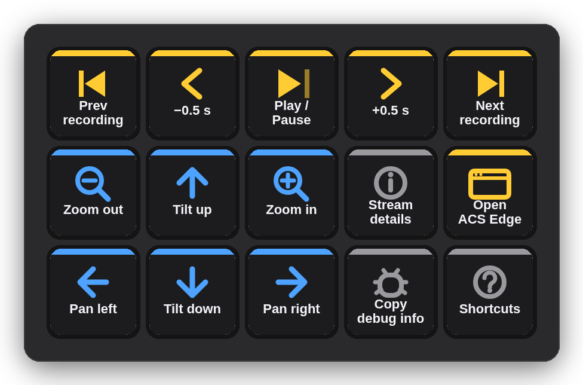
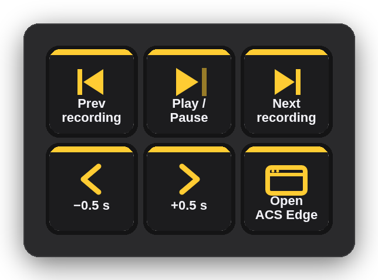
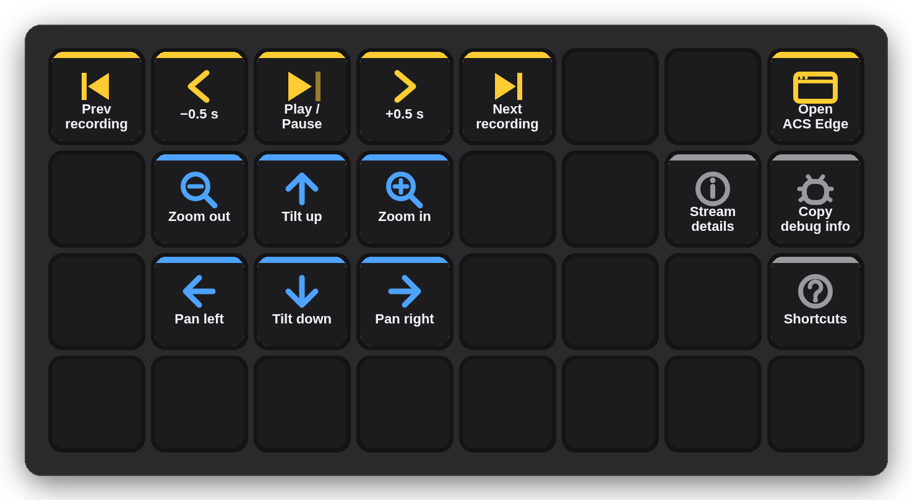

# Deck for AXIS Camera Station Edge

A Stream Deck plugin for **AXIS Camera Station Edge** — recording playback, PTZ and view controls on physical keys. Works with the web app (acs.mysystems.axis.com) and the Windows desktop client; macOS and Windows.

**[Website](https://kotyzap.github.io/Stream-Deck-ACS-Edge-Plugin/) · [Download plugin](dist/com.4xsdev.acs-edge.streamDeckPlugin)**



## Install

Download [`com.4xsdev.acs-edge.streamDeckPlugin`](dist/com.4xsdev.acs-edge.streamDeckPlugin) (or install from the Elgato Marketplace) and double-click it. Stream Deck adds the **ACS Edge Deck** action group and a ready-made profile for your device — **ACS Edge** (15 keys), **ACS Edge Mini** (3×2) or **ACS Edge XL** (8×4).

Requirements: Stream Deck software 6.9+, macOS 12+ or Windows 10+, AXIS Camera Station Edge. On macOS the Stream Deck app needs Accessibility permission to send keystrokes (it already has it if you use Elgato's Hotkey action).

## Actions

| Action | What it does |
|---|---|
| **ACS Edge Command** | Sends one ACS Edge keyboard shortcut to the focused window. Pick it in the key's settings; the key art follows: Previous / next recording (<kbd>J</kbd> / <kbd>L</kbd>) · Back / forward 0.5 s (<kbd>←</kbd> / <kbd>→</kbd>) · Play / pause (<kbd>Space</kbd>) · Zoom in / out (<kbd>Ctrl</kbd> <kbd>+</kbd> / <kbd>−</kbd>) · Pan / tilt (<kbd>Ctrl</kbd> + arrows, desktop client) · Stream details (<kbd>Ctrl</kbd> <kbd>I</kbd>) · Copy debug info (<kbd>Ctrl</kbd> <kbd>Alt</kbd> <kbd>D</kbd>) · Show shortcuts (<kbd>?</kbd>) |
| **Open ACS Edge** | Opens the web app (or any URL you set) — also the quickest way to bring the ACS Edge window to the front before pressing command keys. |

The shortcut goes to whichever window is in front, exactly as if you had typed it. Shortcuts follow Axis's documented [keyboard control](https://help.axis.com/en-us/axis-camera-station-edge) table.

## Profiles

| Mini | XL |
|---|---|
|  |  |

Generated by `profile/build_profile.py` (`LAYOUTS`); the plugin manifest binds each to its device type. The website (`docs/`) is generated by `site/build_site.py`.

## How it works

Stream Deck key → plugin (Node.js, Elgato SDK v2) → keystroke: macOS via System Events (`osascript`), Windows via `SendKeys` (PowerShell). No network, no helper app, nothing stored.

## Building

```bash
cd plugin && npm install && npm run build && cd ..     # bundle → plugin/com.4xsdev.acs-edge.sdPlugin/bin/plugin.js
python3 profile/build_profile.py                      # three .streamDeckProfile files
cp profile/*.streamDeckProfile plugin/com.4xsdev.acs-edge.sdPlugin/
npx @elgato/cli validate plugin/com.4xsdev.acs-edge.sdPlugin
npx @elgato/cli pack plugin/com.4xsdev.acs-edge.sdPlugin -o dist
```

## Limits

- Keystrokes only reach the front window — the plugin cannot know whether ACS Edge is focused.
- PTZ shortcuts exist in the Windows desktop client; in the web app they may do nothing.
- Windows path (SendKeys) was written to Axis's documented shortcuts but has not been tested on Windows hardware yet — reports welcome.

## License

MIT — Pavel Kotyza · [4xs.dev](https://www.4xs.dev). Independent project; not affiliated with Axis Communications or Elgato. AXIS is a trademark of Axis AB.
